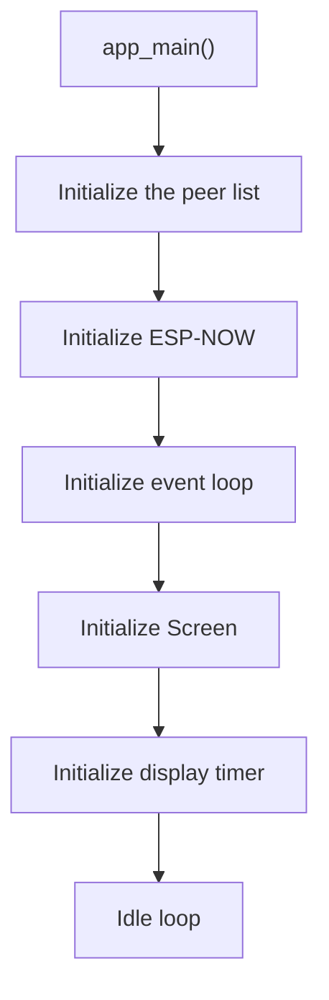
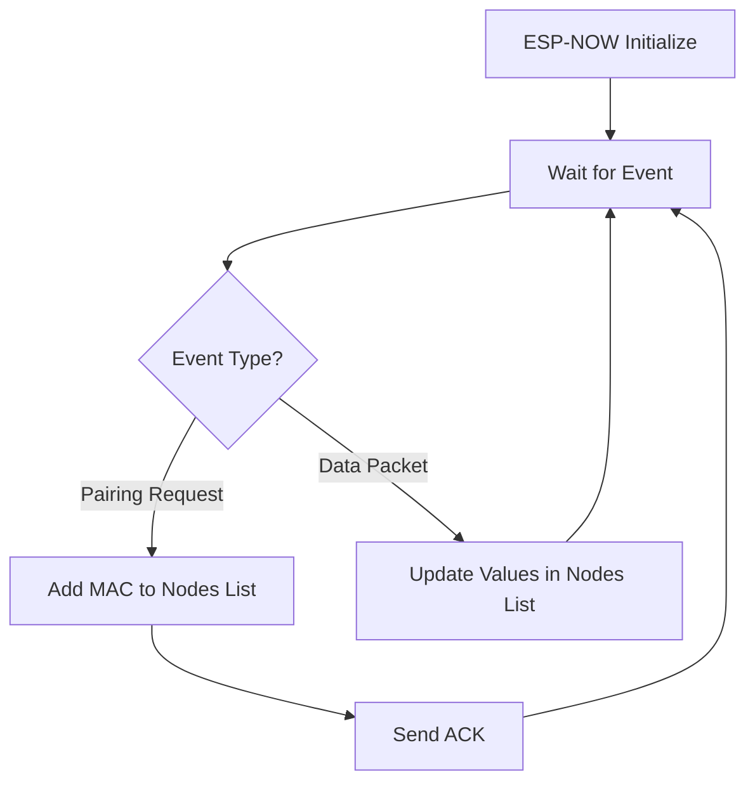
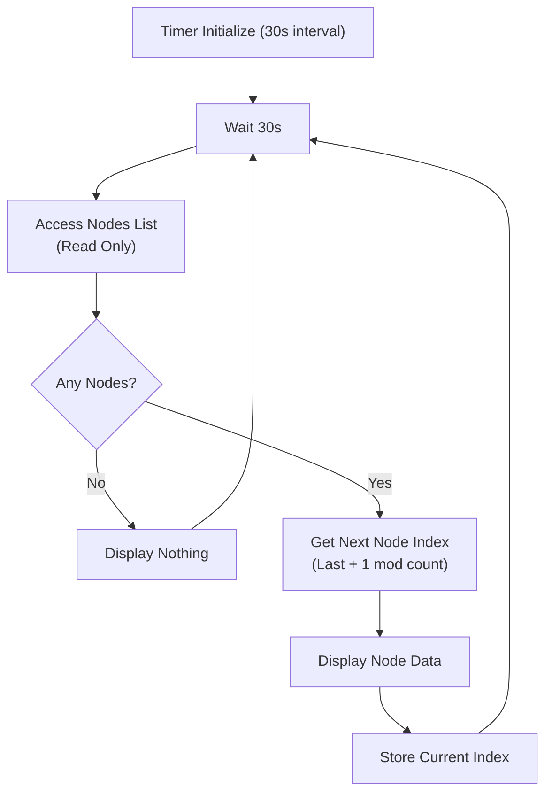
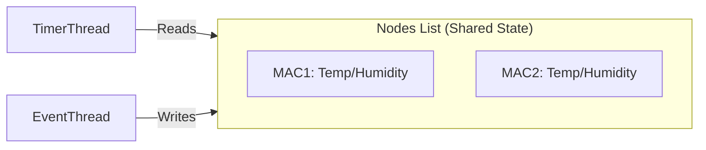

# Zenith Core
 
## Logic

app main logic

```mermaid
flowchart TD
    A["app_main()"] --> B["Initialize the peer list"]
    B --> C["Initialize ESP-NOW"]
    C --> D["Initialize event loop"]
    D --> E["Initialize Screen"]
    E --> F["Initialize display timer"]
    F --> G["Idle loop"]
```

Event loop logic

```mermaid
flowchart TD
    E1["ESP-NOW Initialize"] --> E2["Wait for Event"]
    E2 --> E3{"Event Type?"}
    E3 -->|Pairing Request| E4["Add MAC to Nodes List"] --> E5["Send ACK"]
    E3 -->|Data Packet| E6["Update Values in Nodes List"]
    E5 & E6 --> E2
```

Timer logic

```mermaid
flowchart TD
    T1["Timer Initialize (30s interval)"] --> T2["Wait 30s"]
    T2 --> T3["Access Nodes List<br>(Read Only)"]
    T3 --> T4{"Any Nodes?"}
    T4 -->|No| T5["Display Nothing"] --> T2
    T4 -->|Yes| T6["Get Next Node Index<br>(Last + 1 mod count)"]
    T6 --> T7["Display Node Data"] --> T8["Store Current Index"]
    T8 --> T2
```

Data access

```mermaid
flowchart LR
    subgraph NodesList["Nodes List (Shared State)"]
        direction TB
        N1["MAC1: Temp/Humidity"] 
        N2["MAC2: Temp/Humidity"]
    end
    
    TimerThread -->|Reads| NodesList
    EventThread -->|Writes| NodesList
```
