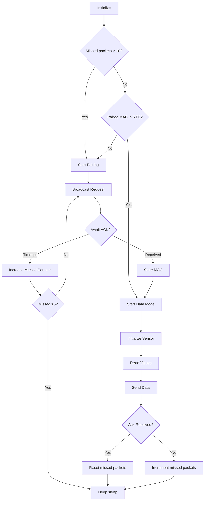

# Zenith Node

## Logic

```mermaid
flowchart TD
    A1["Initialize"]
    A1 --> A2{"Missed packets ≥ 10?"}
    A2 -->|Yes| B1
    A2 -->|No| A4{"Paired MAC in RTC?"}
    A4 -->|No| B1
    A4 -->|Yes| C1
    A5["Deep sleep"]
    B1["Start Pairing"] --> B2["Broadcast Request"]
    B2 --> B3{"Await ACK?"}
    B3 -->|Received| B5["Store MAC"]
    B3 -->|Timeout| B6["Increase Missed Counter"]
    B6 --> B7{"Missed ≥5?"}
    B7 -->|Yes| A5
    B7 -->|No| B2
    B5 --> C1
    C1["Start Data Mode"] --> C2["Initialize Sensor"]  
    C2 --> C3["Read Values"]  
    C3 --> C4["Send Data"]  
    C4 --> C5{"Ack Received?"}  
    C5 -->|Yes| C6["Reset missed packets"]  
    C5 -->|No| C7["Increment missed packets"]  
    C6 --> A5
    C7 --> A5
```
