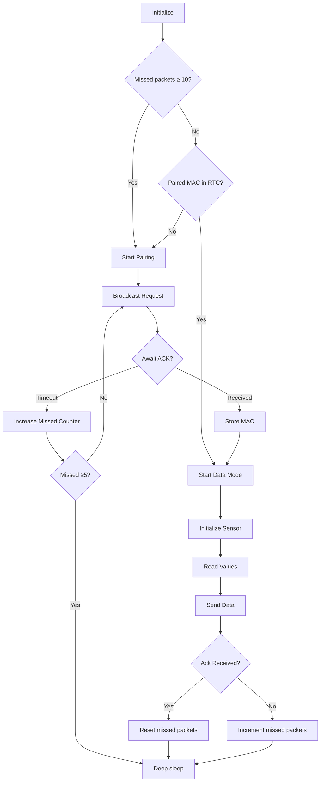

# Zenith Node

Battery powered sensor node that wakes up and reports values to the core at a set interval. It's fairly fault tolerand and self healing.

The node does not retain any information in NVS/Flash and uses the same logic from cold and warm boots. Pairing information is stored in RTC memory in between deep-sleeps. If there's consistent issues with sending data packets it will re-enter pairing mode. The sensor data and information is stored in the core unit - identified by node's mac address.

Current hardware:
- [ESP32c6 super mini](https://www.fibel.no/product/esp32-c6-super-mini/)
- [AHT30 temperature and humidity sensor](https://www.fibel.no/product/aht30-temperatur-og-fuktighetssensor/)
- Single cell LiPo battery from a drone I crashed and never reparied....

## Logic

- Pair if needed
- Read sensor
- Send data
- Deep sleep

