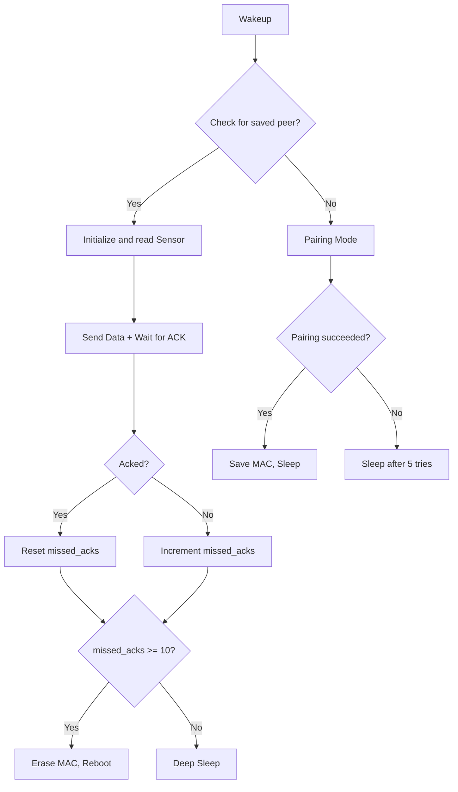

# Zenith Node

## Logic

```mermaid
graph TD
    A[Wakeup] --> B{Check for saved peer?}
    B -->|No| C[Pairing Mode]
    B -->|Yes| D[Initialize and read Sensor]
    D --> E[Send Data + Wait for ACK]
    E --> F{Acked?}
    F -->|Yes| G[Reset missed_acks]
    F -->|No| H[Increment missed_acks]
    G & H --> I{missed_acks >= 10?}
    I -->|Yes| J[Erase MAC, Reboot]
    I -->|No| K[Deep Sleep]
    C --> L{Pairing succeeded?}
    L -->|Yes| M[Save MAC, Sleep]
    L -->|No| N[Sleep after 5 tries]
```