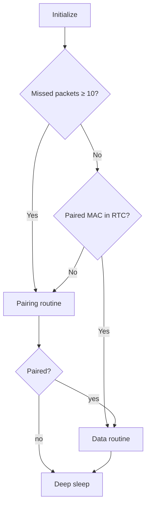
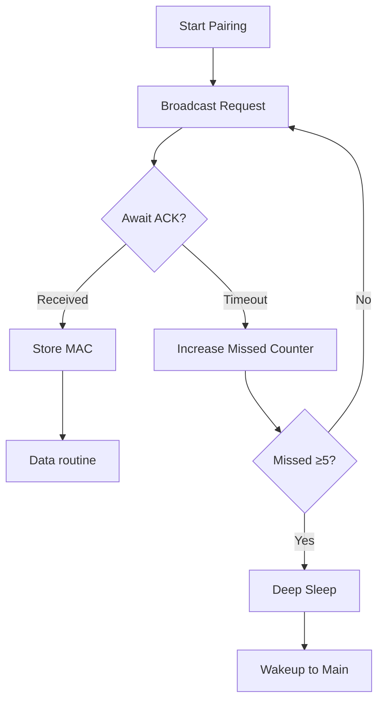
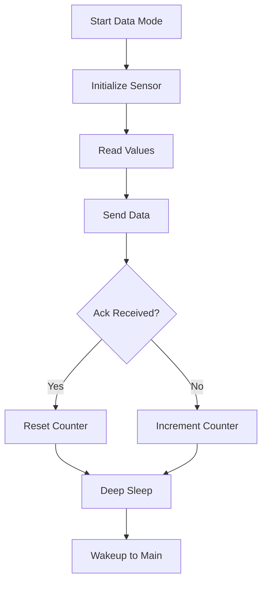

# Zenith Node

## Logic

app_main

```mermaid
graph TD
    A1[Initialize]
    A1 --> A2{Missed packets ≥ 10?}
    A2 -->|Yes| A3[Pairing routine]
    A2 -->|No| A4{Paired MAC in RTC?}
    A4 -->|No| A3
    A4 -->|Yes| A5[Data routine]
    A3 --> A6{Paired?}
    A6 --> |yes| A5
    A6 --> |no| A7[Deep sleep]
    A5 --> A7
```

Pairing routine

```mermaid
graph TD
 A[Start Pairing] --> B[Broadcast Request]
    B --> C{Await ACK?}
    C -->|Received| D[Store MAC]
    C -->|Timeout| E[Increase Missed Counter]
    E --> F{Missed ≥5?}
    F -->|Yes| G[Deep Sleep]
    F -->|No| B
    D --> H[Data routine]
    G --> I[Wakeup to Main]
```

Data

```mermaid
graph TD
    A[Start Data Mode] --> B[Initialize Sensor]  
    B --> C[Read Values]  
    C --> D[Send Data]  
    D --> E{Ack Received?}  
    E -->|Yes| F[Reset Counter]  
    E -->|No| G[Increment Counter]  
    F --> H[Deep Sleep]  
    G --> H  
    H --> I[Wakeup to Main]  
```
