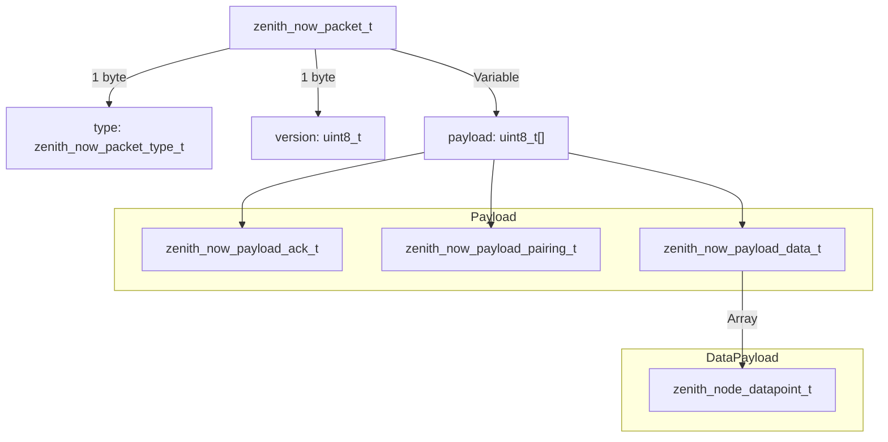
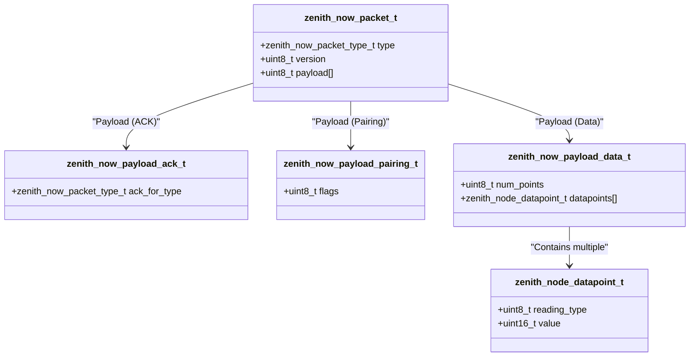
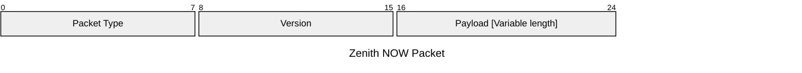
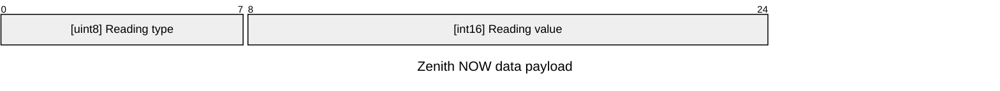
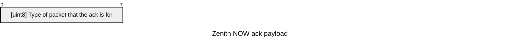
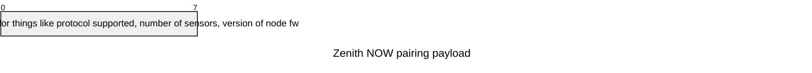

# zenith_now - esp now abstraction

## purpose

Handle all network connectivity. Currently only ESP-NOW is supported, but I know I might end up abstracting it and doing bt-le. also thread looks very interesting

### Protocol

[zenith_now.h](include/zenith_now.h)

