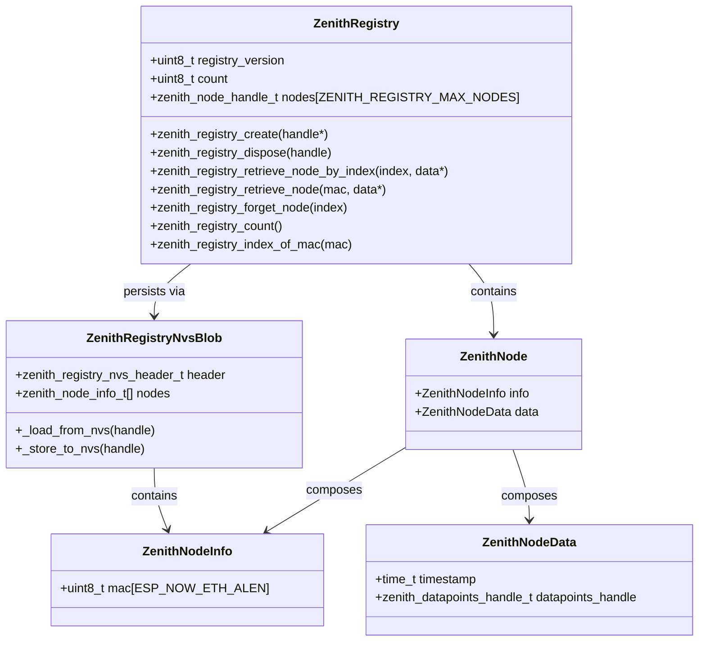
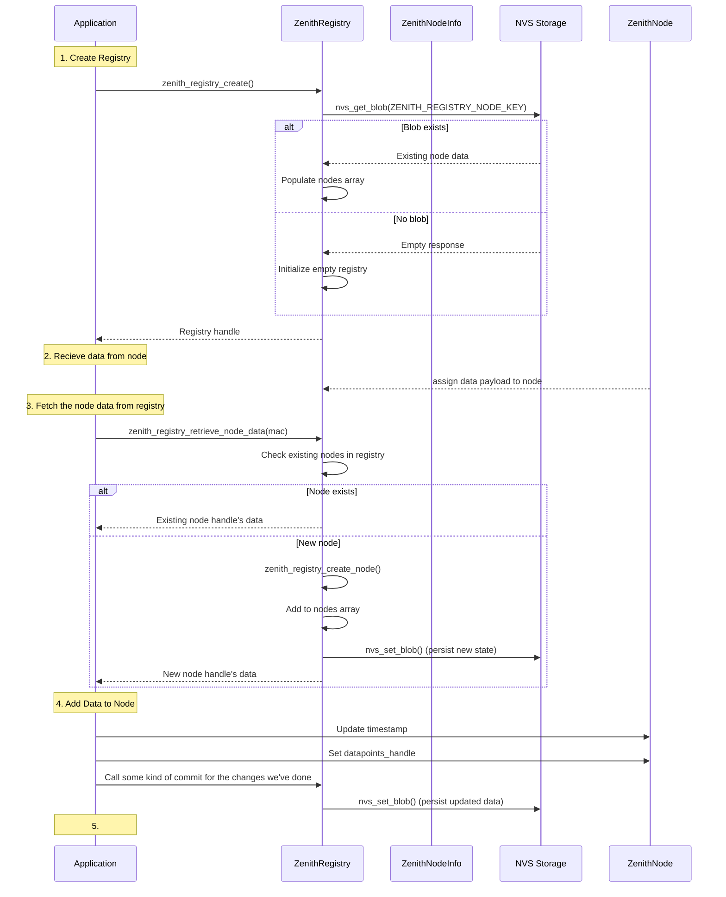

# Zenith Registry

The Zenith Registry stores infomration about paired Zenith Nodes on the Zenith Core.

After rewriting the registry 3 or 4 times using different ideas and patterns for storage and retrieval, I finally understood what drives Zenith - it's the data. 

I'm therefore doing yet another total rewrite of this, and this time I hope to unify data handling. That will include:
- Zenith Core (this iw easy enough, as that's where the Registry was born)
- Zenith Node - new implementation. currently uses another datastructure
- Zenith Now - new ipmlementation. currently uses another datastructure


## Zenith Registry has two interfaces:

### Data interface (Producer Role)

    1. Zenith node
        1. collect and send data
    2. Zenith core
        1. receive data
        2. node pairing
        3. node information or configuration change

### Observer interface (Consumer Role)

    1. Zenith Core UI
    2. Zenith Zigbee

## Event Notification
```c
typedef enum {
    REGISTRY_EVENT_NODE_ADDED,
    REGISTRY_EVENT_NODE_REMOVED,
    REGISTRY_EVENT_READING_UPDATED,
    REGISTRY_EVENT_NODE_UPDATED
} registry_event_t;

// Register a callback that receives events
esp_err_t registry_register_callback( registry_handle_t registry, void ( *callback )( registry_event_t event, const uint8_t mac[6] ) );

```

## Base structures

### zenith_reading_t

Zenith Node does not have accurate clock, so timestamps are added on innsertion into the registry. Data up to that point lives as datapoints.

```c
typedef enum zenith_sensor_types_e {
    ZENITH_SENSOR_TYPE_TEMPERATURE = 1,
    ZENITH_SENSOR_TYPE_HUMIDITY,
    ZENITH_SENSOR_TYPE_PRESSURE,
    ZENITH_SENSOR_TYPE_MAX
} zenith_sensor_type_t;

typedef struct {
    zenith_sensor_type_t sensor_type; // "temperature", "humidity", etc.
    int32_t value;           // Fixed-point value (e.g. *100 for centigrade)
} zenith_datapoint_t;

typedef struct zenith_reading_s {
    zenith_datapoint_t datapoint;
    uint32_t timestamp;      // Seconds since epoch or boot
} zenith_reading_t;
```

## Usage

### Zenith Node

```c
#include "zenith_sensor.h"
esp_err_t zenith_sensor_read_all( zenith_sensor_t *sensor, zenith_datapoint_t *out_datapoints[], size_t *out_count);
#include "zenith_now.h"
esp_err_t zenith_now_send_data(const uint8_t dest_mac[6], const zenith_datapoint_t *datapoints[], size_t count);

void app_main{
    size_t datapoints_count = 0;
    zenith_datapoint_t *datapoints;
    esp_err_t ret = zenith_sensor_read_all( sensor, &datapoints, &datapoints_count );
    if ( ret == ESP_OK )
        ret = zenith_now_send_data( paired_core.mac, datapoints, datapoints_count );
    return ret;
}
```

### Zenith Core

1. Data receipt

    1. Zenith now posts a data receive event to the event queue. the event needs to contain the readings and the count. somewhat similar as today.

    2. The core eventhandler picks the data packet up and posts it to the registry

2. Pairing request

    1. Zenith now posts a pairing request event to the event queue. 

    2. The core eventhandler stores the node information in the registry and acknowledge the pairing request

3. UI changes

    1. The user changes node settings or information

    2. The changes are saved to the registry


4. Zigbee report

    1. Register callback that updates the values from the registry to the Zigbee driver.

    2. The Zigbee Coordinator asks for the latest data. This data is read from the Zigbee driver
  
```c
esp_err_t zenith_now_receive_data(const uint8_t *payload, size_t len, zenith_datapoint_t *out_readings[], size_t *out_count);
```


### Api

```c
// Producer (Core) API
esp_err_t registry_store_node_info(const uint8_t mac[6], const zenith_node_info_t *info);
esp_err_t registry_store_readings(const uint8_t mac[6], const zenith_reading_t *readings, size_t count);
esp_err_t registry_remove_node(const uint8_t mac[6]);

// Observer (UI/Zigbee) API
esp_err_t registry_get_node_info_by_mac(const uint8_t mac[6], zenith_node_info_t *out_info);
esp_err_t registry_get_node_info_by_index(size_t index, zenith_node_info_t *out_info);
esp_err_t registry_get_latest_readings(const uint8_t mac[6], zenith_reading_t *out_readings[], size_t *out_count);
esp_err_t registry_get_sensor_history(const uint8_t mac[6], zenith_sensor_type_t type, zenith_reading_t *out_history[], size_t *out_count);

```


---

---

old info

---

---


## Use case


### Use Case 1: Core receives data 

Actors: Zenith Node, Zenith Core Event Handler, Zenith Registry

1. Create registry
2. Receive data from node
3. Store the data for the node in the registry
5. Release the node

---

### Use Case 2: Zenith Core UI wants to get to the goodies

This will be Very similar to Zigbee perhaps?

Actors: Zenith Core UI, Zenith Registry

1. Receives handle to registry
2. Retrieve data for a node from the registry. No touch, only watch!

---

### Use Case 3: Peering request

Actors: Zenith Node, Zenith Core Event Handler, Zenith Registry, Zenith Core App

1. APP: Create registry
2. Node: sends pairing request to Core
3. Core: Acknowledge pairing request
4. Core: Updates the info section in the registry
5. Registry: Creates a new handle and copies data 
5. Registry: detects existing handle with data.
     - Frees existing handle
5. Registry:
     - Registry creates new handle, with the data.
     - Updates NVS

     - Frees the existing handle
     - Create
5. Copy over the info
5. Registry saves state to NVS

1. 
---

zenith_registry_create( &handle );

zenith_node_data_handle_t node_data;
zenith_registry_get_node_data( handle, node_mac, &node_data );

zenith_node_info_handle_t node_info;
zenith_registry_create_info( handle, &node_info );

zenith_registry_save_node_info( handle, node_mac, node_info );





