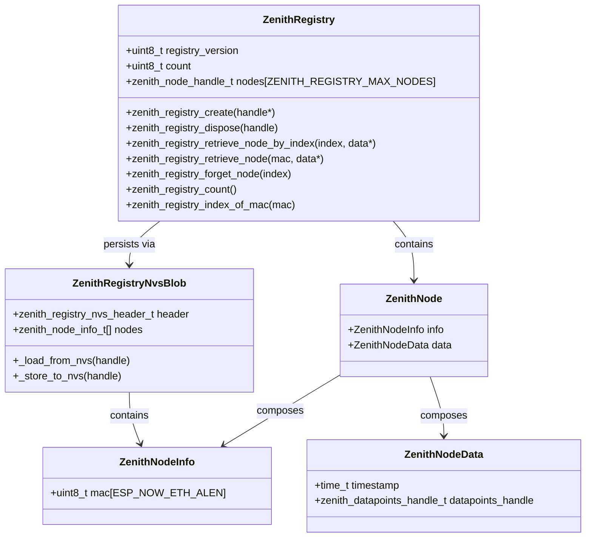
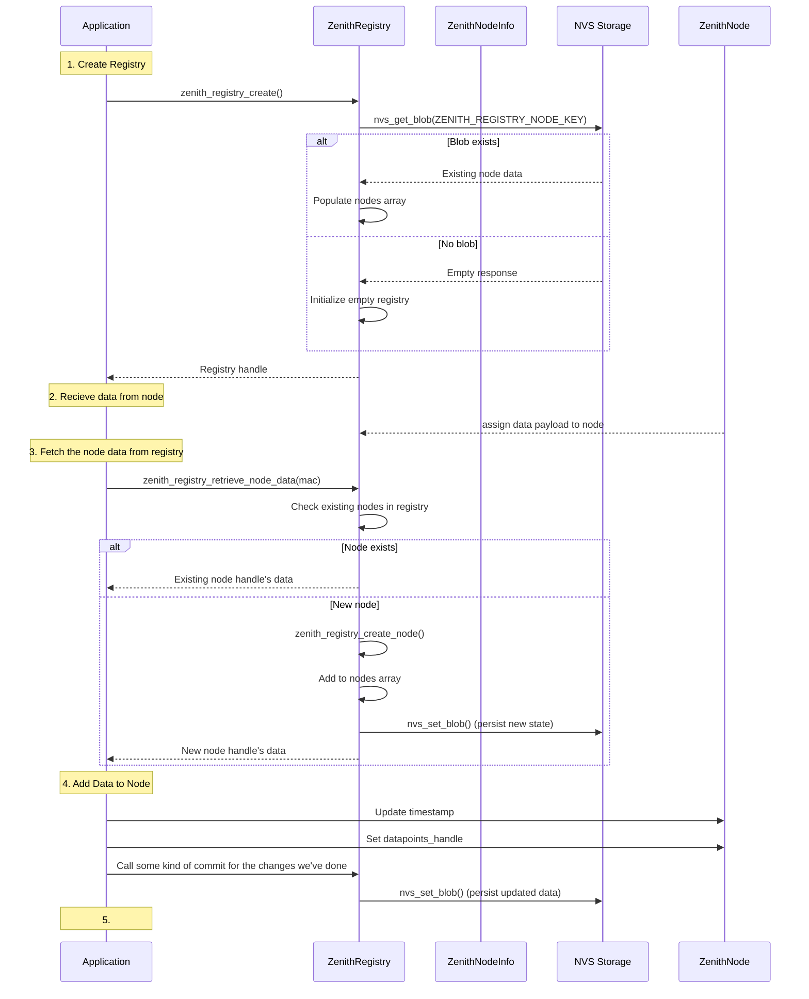

# Zenith Registry

The Zenith Registry stores infomration about paired Zenith Nodes on the Zenith Core

## Use case

### Use Case 1: Core receives data 

Actors: Zenith Node, Zenith Core Event Handler, Zenith Registry

1. Create registry
2. Receive data from node
3. Store the data for the node in the registry
5. Release the node

---

### Use Case 2: Zenith Core UI wants to get to the goodies

This will be Very similar to Zigbee perhaps?

Actors: Zenith Core UI, Zenith Registry

1. Receives handle to registry
2. Retrieve data for a node from the registry. No touch, only watch!

---

### Use Case 3: Peering request

Actors: Zenith Node, Zenith Core Event Handler, Zenith Registry, Zenith Core App

1. APP: Create registry
2. Node: sends pairing request to Core
3. Core: Acknowledge pairing request
4. Core: Updates the info section in the registry
5. Registry: Creates a new handle and copies data 
5. Registry: detects existing handle with data.
     - Frees existing handle
5. Registry:
     - Registry creates new handle, with the data.
     - Updates NVS

     - Frees the existing handle
     - Create
5. Copy over the info
5. Registry saves state to NVS

1. 
---

zenith_registry_create( &handle );

zenith_node_data_handle_t node_data;
zenith_registry_get_node_data( handle, node_mac, &node_data );

zenith_node_info_handle_t node_info;
zenith_registry_create_info( handle, &node_info );

zenith_registry_save_node_info( handle, node_mac, node_info );

