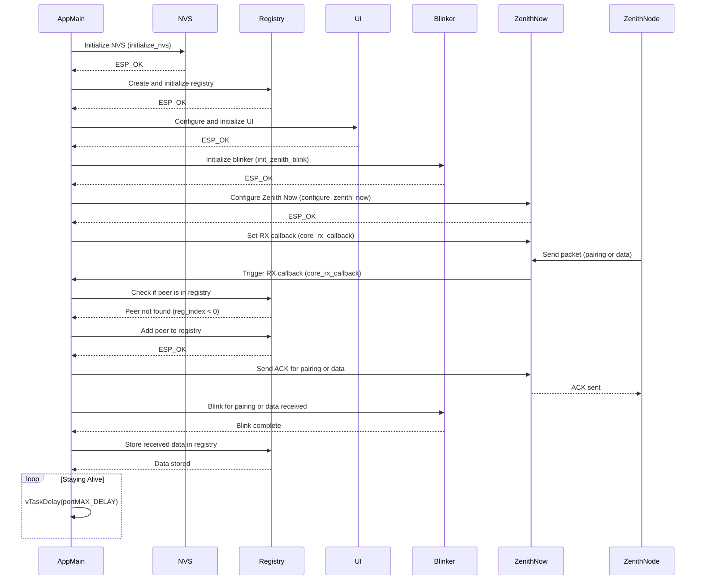
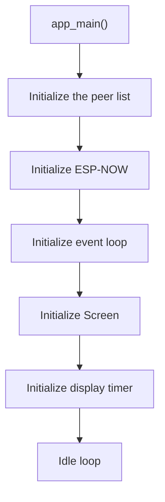
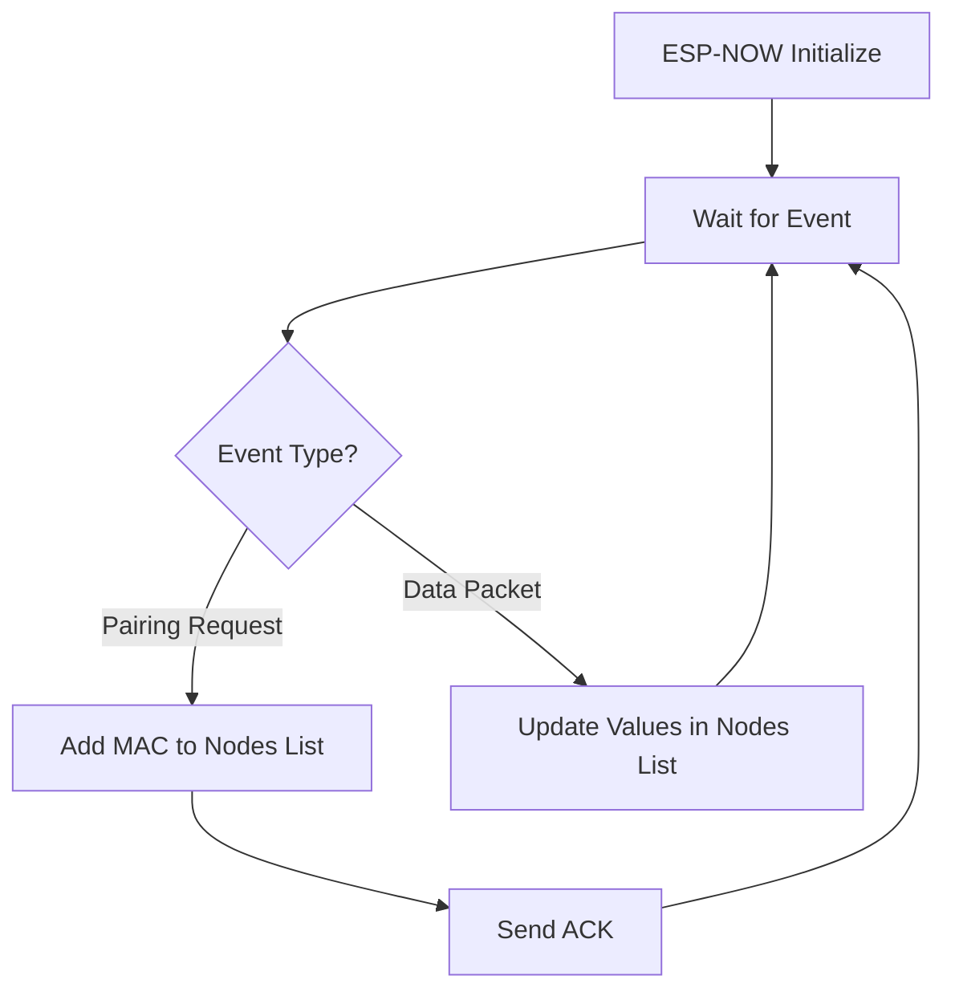
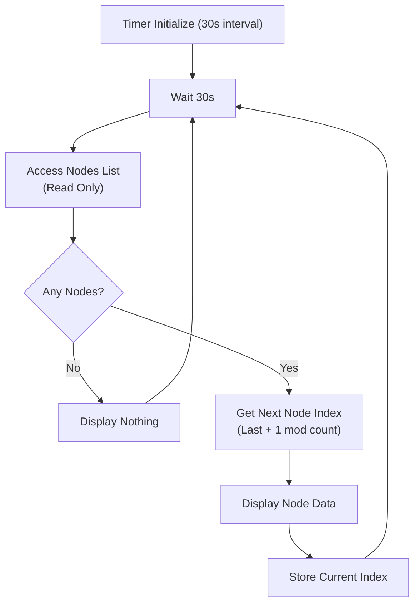
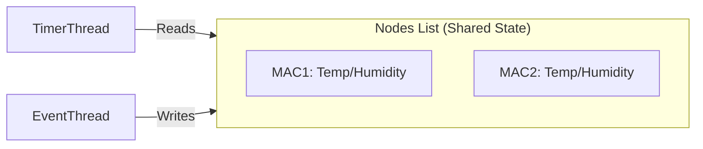

# Zenith Core

The central unit that node units report their sensor data to the core at set intervals. This data is presented on a screen and can optionally be sent over Zigbee HA to a Zigbee home automation system.

To be implemented:
- Storing data
- New UI
- Node configuration
  - Report interval
- Zigbee HA

## Logic

- Event loop for receiving data
- Touch enabled UI
- Timer that loops through stored nodes when idle

app main logic

Event loop logic

Timer logic

Data access

